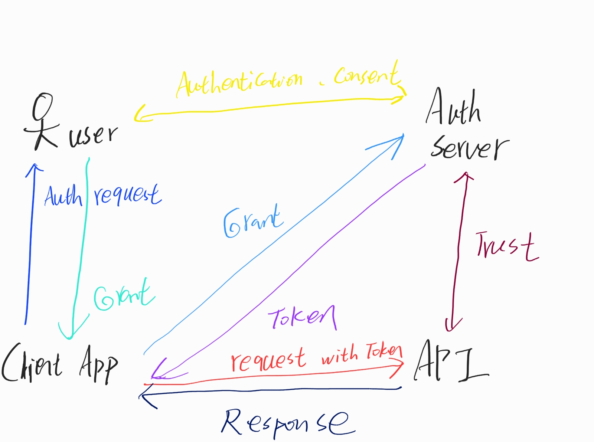

## Background

有許多的應用程式會向另外的應用程式進行授權，以便可以讀取用戶的相關資訊與部分系統API的使用權，例如可能某系統要讀取 google drive 內有哪些的檔案，可以查看檔案的大小、上傳時間等，此時就需要 google drive
的授權使用才能獲取。

OAuth 就是解決不同的應用程式如何進行授權的 solution。

## Why Oauth2

在網站的 api 設計上，與其它系統間權限的設計一直是麻煩的問題。如何驗證當前的使用者或是已授權的系統使用 API。

在過去可能會採用憑證共享( credential sharing )的方式，使用者透過帳號與密碼登入至 API。使用這方式有一些的缺點。

1. 無法判斷是**應用程式**或是**人**正在使用這API，因為無法判斷是人或是程式，所以無法限制API的權限(例如只有人可以刪除檔案，但程式不行)
2. 若API出現問題造成密碼流失，可能會導致使用者的所有其他網站密碼(可能密碼皆相同)洩漏。
3. 若API需要使用者的帳號和密碼很容易遭到有心人士攻擊竊取
4. 若該網站是靜態網站，代表他無法進行帳號的權限管控(因為沒後端&DB)

另外一種方式是使用 cookie ，當用戶登入後將授權資訊存入 cookie 中，當需要進行API請求時使用 cookie 進行驗證。但仍然有許多的缺點。

1. CSRF([讓我們來談談 CSRF](https://blog.techbridge.cc/2017/02/25/csrf-introduction))
2. cookie 授權是儲存在 browser 上，若換一個瀏覽器又必須重新授權

還有一種方法是使用 API Keys，原系統提供一組Key讓外部系統也可以執行某些API(例如讀取 google drive 的檔案等)，這方法可以解決憑證共享遇到的大部份問題。 API Keys 遇到的問題仍然是安全性，若在靜態檔案中將
key 的資訊帶入，代表其他 user 也可以透過這個 key 獲取資訊。二是 key 不會過期，對使用者來講可能會很方便，但若有心人士得到 key 就會發生問題，當然也可將 key 定期做更換，但頻率很難進行定義。

## Intro OAuth

OAuth2 是一個 authorization framework 專門為HTTP API 建立的授權框架，它允許使用者依照個人需求，將部分 API 委托給其他的系統去做使用，依照使用者的授權程度，其他系統可自由地與使用者允許的 API
進行通訊，也可以描述 OAuth 是一種委託的協議( delegation protocol )。

### OAuth有4個角色

1. protected resource (http api)
2. client (request application) 要求API使用的系統
3. resource owner (user)
4. authorization server 負責處理授權工作的server

### 基本流程



1. Client application 向 resource owner 請求使用API的權限
2. Owner 登入系統( 例如 facebook, google 等 )驗證是否為本人
3. Owner 驗證通過且同意後給 client application 憑證
4. client application 向 authorization server 發送憑證請求 token(OAuth 未規定 token 的格式，json, hash, 字串等都可以)
5. authorization server 回傳 access token
6. client application 帶著 token 向 API 請求服務
7. API 與 authorization server 進行認證
8. 確認無誤後回傳 response

### OAuth的flow

> oauth 有不同的 flow 實作方式，大致上相同，但仍有些差異。
> 使用的場景也有些不同。

#### Authorization Code Grant Flow

> 主要使用於高安全性的客戶端或是網站是使用server backend的模式

##### Authorization request

```
https://authserver.example.com/authorize
    ?response_type=code # 告知使用code flow
    &client_id=a123e5ac # uniq id
    &redirect_uri=https://client.example.com/callback # 向 auth server 拿完 token 後，進行導向的路徑
    &state=xyz # 可以用來帶資訊或是進行CSRF驗證
    &scope=api.read api.delete # client 可使用的權限
```

##### Authorization response

```
https://client.example.com/callback
    ?code=adkfndoq1a5d # grant
    &state=xyz # match request state
```

##### Token request

```
POST /token HTTP/1.1
Host: server.example.com
Content-Type: application/x-www-form-urlencode
Authorization: Basic ad3123adfeq5d1a3g5

grant_type=authorization_code
&code=6DF61D6gda5D
&redirect_uri=https:/client.example.com/cb
&client_id=D5DFDGH6dD
```

##### Token response

```
HTTP/1.1 200 OK
Content-Type: application/json

{
  "access_token": "56DGE7g9D",
  "token_type": "Bearer",
  "expires_in": 3600,
  "scope": "api.read"
}

```

#### Implicit Flow

> 適合用於 SPA 的 flow，與其它 flow 不同之處在於是由 owner 直接 access token 給 client application，而不是由 client application 發送 grant 至 authorization server 在得到 access token

##### Authorization request

```
https://authserver.example.com/authorize
    ?response_type=token
    &client_id=a16ad97
    &redirect_uri=https://client.example.com/callback
    &state=xyz
    &scope=api1 api2
```

##### Authorization response

````
https://client.example.com/callback
    #access_token=2dkaEd61HDd
    &token_type=example
    &expires_in=3600
    &state=xyz
````

> :exclamation: access token 會是公開的

#### Client Credentials Flow

> 用於 client application 就是 resource owner，適用於 machine to machine 的溝通，與其他 flow 不同的地方在於移除了 resource owner 的角色，由 client application 直接向 authorization server 發送 credentials

##### Token request

```
POST /token HTTP/1.1
Host: server.example.com
Content-Type: application/x-www-form-urlencoded
Authorization:  Basic DKad6461aVHKD5a6

grent_type=client_credentials
&scope=api1 api2
```

##### Token response

```
HTTP/1.1 200 OK
Content-Type: application/json

{
    "access_token": "d68adf899GDag5adqe",
    "token_type": "Bearer",
    "expires_in": 3600,
    "scope": "api2"
}
```

#### Resource Owner Password Credentials Grant Flow

> 主要用於 legacy application，使用帳號與密碼進行登入

> :exclamation: 除了較舊的系統，其它沒有理由使用這個 flow，username, password 造成了許多安全性的問題

##### Token request

```
POST /token HTTP/1.1
Host: server.example.com
Content-Type: application/x-www-form-urlencoded
Authorization: Basic dal58S6gDeqdHH

grant_type=password
&username=johnusername
&password=123password
&scope=api1
```

##### Token response

```
HTTP/1.1 200 OK
Content-Type: application/json

{
    "access_token": "69dHRyGLD36G",
    "token_type": "Bearer",
    "expires_in": 3600,
    "scope": "api1"
}
```

## Refresh Token

> 提供手動刷新 token 或是自動時間刷新，使用者必須被告知刷新了新的 token

### Refresh token request

```
POST /token HTTP/1.1
Host: server.example.com
Authorization: Basic ccasG8SW651db
Content-Type: application/x-www-form-urlencoded

grant_type=refresh_token
&refresh_token=doa58DG2a3DDG9q
&scope=api
```

### Refresh token response

```
HTTP/1.1 200
Content-Type: application/json

{
    "access_token": "9PKda87mM",
    "token_type": "Bearer",
    "expires_in": 3600,
    "refresh_token": "doa58DG2a3DDG9q",
    "scope": "api1 offline_access"
}
```

## Error

> 當發生錯誤時，會回傳 error response

### Authorization Error response

```
https://authserver.example.com/authorize
    ?error=invalid_request
```

### Token Error response

```
HTTP/1.1 400 Bad Request
Content-Type: application/json;charset=UTF-8
Cache-Control: no-store
Pragma: no-cache

{
    "error": "invalid_request"
}
```

### Error Type

- invalid_request
- invalid_client ( 401 )
- invalid_grant
- unauthorized_client
- unsupported_grant_type
- invalid_scope

